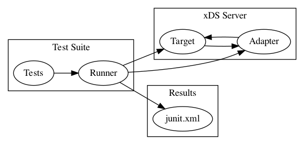

- [Context and Scope](#org6d6e3f4)
  - [Goals](#org11e2937)
  - [Non-goals](#orga3da61e)
- [Overview](#orgdbf254d)
- [Detailed Design](#org79866f6)
  - [Architecture](#org917dd85)
  - [Definitions](#orgeb74efd)
  - [Test Case Format](#org6a0f90a)
  - [Iterating through the test cases](#org035dfac)
  - [Implementing the tests](#org2f7548b)
  - [The Adapter protocol](#orgd42e8d5)
- [Considered Alternatives](#orgcc6a98d)

<a id="org6d6e3f4"></a>

# Context and Scope

This document outlines the implementation of a conformance test suite for the xDS protocol. It builds off designs and requirements established in the [xDS conformance Statement of Work](https://docs.google.com/document/d/17E3k4fGJedVISCudrW4Kgzf89gvIIhAdZnJmo6pMVlA/edit), outlining how these requirements can be best implemented.

<a id="org11e2937"></a>

## Goals

- Define a test case description format.
- Define a test case grammar, in which new test cases can be easily composed.
- Create a test binary that can be run against an arbitary xDS server and output its results.
- Set an extensible framework that can be easily modified to handle complex scenarios as they are discovered.

<a id="orga3da61e"></a>

## Non-goals

- Write a test case language.
- Test envoy specific scenarios (the cases should be implementation-agnostic).
- Write all known test cases.

<a id="orgdbf254d"></a>

# Overview

The test suite is a language-agnostic binary that runs against a specified server that has been previously setup to be testable. This setup is, namely, implementing an adapter that we&rsquo;ve specified through a gRPC schema. This adapter sets the required state for each test scenario and cleans up the enviornment between scenarios.

The test cases are written separate from their implementation, using the [gherkin](https://cucumber.io/docs/gherkin/reference/) testing language. This allows for a consistency in how test scenarios are articulated, while allowing the test runner to be a patchwork of implementations written in multiple languages, depending on whichever is best suited for the test scenario.

<a id="org79866f6"></a>

# Detailed Design

<a id="org917dd85"></a>

## Architecture

The architecture closely matches the original diagram in the Statement of Work.

A test runner is started with a simple config for how to connect to the target and its adapter. It iterates over all the test cases, using the adapter to set the necessary state for a test, and the target to test the actual xDS behaviour, then logs the results to a shareable file.



<a id="orgeb74efd"></a>

## Definitions

All definitions in the Statement of Work carry over to this design document. In addition, there are these terms specific to our implementation.

- **gherkin/cucumber:** A test case language intended for &ldquo;behaviour driven development&rdquo;. What our tests are written in.
- **godog:** a go tool for structuring and running tests written in gherkin.

<a id="org6a0f90a"></a>

## Test Case Format

Following the gherkin syntax, our tests are setup as &ldquo;Scenarios&rdquo; grouped together into a set of &ldquo;Features&rdquo; that, all together, describe xDS conformance. Each scenario is a self-contained series of steps outlined in this format:

```feature
Given a specfific target state
When some action occurs
Then we see the expected results
```

Each step in a scenario is mapped to a function, with any keywords or example docstrings in the step passed along as arguments. This makes our steps reusable across scenarios.

Because of this, the test suite builds up a grammar of phrases. Consistent phrasing allows for tests to be written without having to adjust (or event touch) the test&rsquo;s implementation.

For example, multiple scenarios could be written with this exact same format:

```feature
Given a target state matching yaml:
```

...yaml...

```

When a discovery request is sent matching yaml:
```

...yaml...

```

Then a discovery response is received matching yaml:
```

...yaml...

```

```

Each scenario would have distinct yaml examples, and the body of the yaml implies the intent of the test.

While the composability is nice, it can make the tests less clear than we&rsquo;d want, as a reader must deduce what we intend to test by the subtle changes in the yaml in each step. Because of this, a comment is placed at the top of the scenario giving a gherkin-free version of the test&rsquo;s intent. Grouping the scenarios by feature will also help communicate broader intent.

Ideally, much of the work of building the test suite will be in establishing a clear, reusable grammar with the implementation kept simple and functional

<a id="org035dfac"></a>

## Iterating through the test cases

Proper folder structure will let us use godog&rsquo;s default behaviour to iterate over the tests. Specifically, all tests will be contained in a `features` file in the test suite repository. When godog is invoked (whether by itself, or within a function of our test suite), then it will run through each feature.

There is no guaranteed order to how the tests are run, and so each scenario assumes a fresh state in the target server, runs through the test, and then rests the server for whichever scenario comes next.

<a id="org2f7548b"></a>

## Implementing the tests

Our actual runner is a Go struct with a set of defined methods, each method mapped by regex to a gherkin step. This means that running the tests is a matter of godog matching the feature to it&rsquo;s callable functions and evaluating the results.

The Runner struct includes fields for maintaining connections to the target across steps, and channels for receiving messages from the target to be read by the appropriate step.

<a id="orgd42e8d5"></a>

## The Adapter protocol

The adapter is a gRPC API defined in the test harness repo whose intention is to set the required state for each test to run cleanly, in isolation.

As part of conformance, the target is expected to implement this api and provide a connection point to our runner. We do not care how it is implemented, as long as it follows our spec.

The adapter has two services `SetState` and `UpdateState`. `SetState` is used to clear out a target and set it to some new, clean state. Update is used when the scenario is stateful, e.g. when we need to track the chain of versions created across steps in one scenario.

<a id="orgcc6a98d"></a>

# Considered Alternatives

Will need to visit this section with the team, and clarify what alternatives are available and whether there is a better alternative. I can see two forms of alternatives: one is to choose a different test syntax and format. The other is to choose a different way of implementing our test runner.

For the test syntax, what are other used languages? To me it is a non-starter if the test is wrapped up in the implementation, or can only be described as a single line. So one option we could use is the native go testing, but it does not have a separate syntax that I am aware of and it limits us to having the entire runner written in go. An informal expectation we had is the ability to have like modules of a test runner, anticipating a situation where it is better to have an implementation written in Python or some other language, but still following the gherkin test spec. We couldn&rsquo;t do that with go testing.

However, this is assuming something larger (that this will need to be a multi-lingual test framework) and that is an assumption we should check.

In terms of the implementation, I am not sure of clear, alternative structures for this. In other words, the specification is vague enough at this stage that we know it will be revisited. During a revisit, I could imagine alternatives coming up based on specific parts of the implementation.

This makes me realize this design doc, just yet, is perhaps not specific enough. It will be good to see from other team members what currently feels unanswered in what I laid out.
